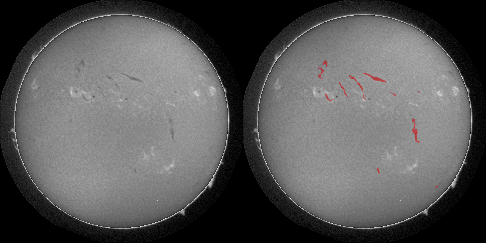

# Solar Filament Segmentation: MAGFiLO Challenge

## Overview

This repository contains a deep learning pipeline designed for the automated, pixel-level segmentation of solar filaments from H-Alpha observations. The algorithm targets the MAGFiLO (Manually Annotated GONG Filaments from H-Alpha Observations) dataset to identify contiguous physical structures while delineating fine-scale morphological features such as thread-like barbs. The approach minimizes the inclusion of background noise and imaging artifacts, optimizing for high Panoptic Quality and Dice scores by reducing structural fragmentation and over-merging.

## Methodology and Architecture

The core segmentation engine utilizes a DeepLabV3 architecture coupled with a ResNet50 backbone. To accommodate the specific properties of the astronomical data, the initial convolutional layer is modified to natively accept single-channel grayscale inputs by aggregating the pretrained weights across the spatial dimensions. Model optimization is driven by a composite CEDiceLoss function, which linearly combines CrossEntropy and Soft Dice Loss to counteract the severe class imbalance inherent in the small pixel footprint of filament structures.

To prevent the destructive loss of fine-scale features caused by whole-image downsampling, the training pipeline extracts random high-resolution crops. This ensures the network learns morphological representations at their native pixel scale. During validation and testing, the architecture transitions to a sliding-window inference methodology. The sliding-window algorithm extracts overlapping tiles across the full-resolution input, processes them through the network, and stitches the resulting logits back into a coherent spatial map by averaging predictions within overlapping boundaries. This technique guarantees that extensive, contiguous filament topologies are reconstructed with high fidelity.

## Repository Structure

* **`main.py`**: The primary command-line interface orchestrating model training, inference, and visualization routines.

* **`dataset.py`**: Implements the PyTorch Dataset classes, integrating COCO-format JSON parsing for ground-truth masks and automated Kaggle API data retrieval.

* **`train.py`**: Contains the model instantiation, composite loss function definitions, and the epoch-based training and validation loops.

* **`sliding_window.py`**: Executes the overlapping tile inference algorithm to generate full-resolution segmentation masks without downscaling artifacts.

* **`create_submission.py`**: Processes raw predicted masks via connected components analysis to isolate individual filament instances and encodes them into compressed COCO-style RLE strings for final evaluation.

* **`augmentations.py`**: Defines the Albumentations transformation pipelines, strictly separating random spatial cropping for training from full-resolution normalization for evaluation.

* **`visualize.py`**: Generates diagnostic side-by-side overlays of the predicted masks against the original grayscale H-Alpha imagery.

* **`plot_history.py`**: Parses the JSON-based training logs to plot loss and Intersection over Union (IoU) curves.

* **`config.py`**: Centralizes file path resolutions and hyperparameters using OmegaConf.

* **`utils.py`**: Provides global seeding mechanisms to ensure deterministic execution alongside general file-system utilities.

## Installation and Setup

Pay attention: dependencies size is up to 15 GB. \
Follow these steps to download the project and set up your environment:

1. **Clone the repository:**
   ```bash
   git clone https://github.com/mvidem-gallery/SolarFilaments.git
   cd SolarFilaments
   ```

2. **Install dependencies:**
   It is highly recommended to use a virtual environment (such as `venv` or Conda). Once your environment is active, install the required packages:
   ```bash
   pip install -r requirements.txt
   ```
   *(Note: The `requirements.txt` file is required for the final competition submission to ensure reproducibility.)*

## Usage Guide

Execution is centralized through `main.py`. If invoked without arguments, the script automatically authenticates via the Kaggle API to download the dataset (if missing) and initiates the training loop based on the parameters defined in `config.yaml`.

To generate diagnostic plots of the training trajectory after completion, run the history utility:

```bash
python main.py -history --output metrics.png
```

To compile the final competition predictions into a required CSV format, complete with RLE encoding for each distinct filament instance:

```bash
python main.py -submission
```

To execute sliding-window inference on the test dataset and output raw segmentation masks as PNG files:

```bash
python main.py -predict
```

To generate comparative visualizations overlaying the resulting predictions onto the source test images for qualitative inspection:

```bash
python main.py -visualize
```